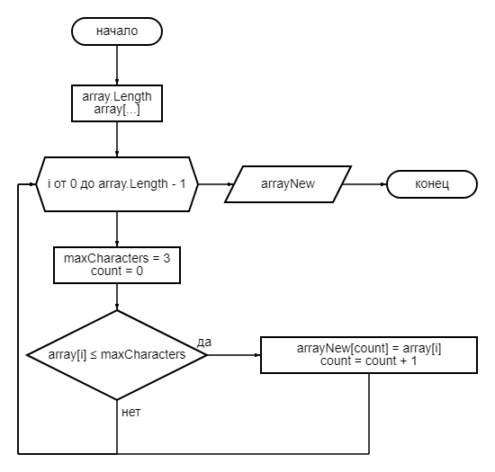

1) Через функцию ввода значений с клавиатуры **GetArrayLengthFromUser** задаем длину массива.
2) Через функцию **GenerateArrayFromUser** генерируем исходный массив.
3) Через функцию **PrintArray** выводим в консоль сгенерированный массив.
4) Через функцию **NumberOfValuesUpToThreeCharacter** определяем элементы массива которые содержат до 3-х знаков.
5) Через функцию **ArrayOfDataThreeCharacters** генерируем новый массив с элементами содержащими до 3-х знаков из исходного массива.
6) Через функцию **PrintArray** выводим в консоль сгенерированный новый массив.